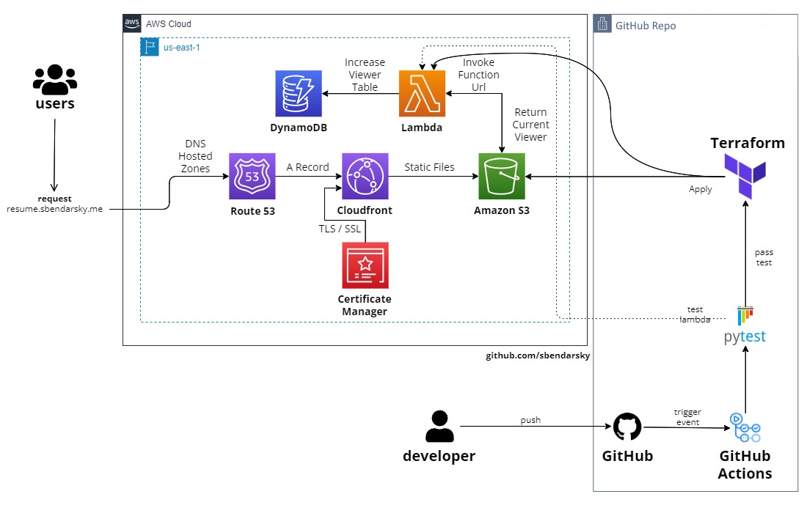

# AWS - Cloud Resume Challenge
The [The Cloud Resume Challenge](https://cloudresumechallenge.dev/) is all about flaunting your skills in cloud tech. I've built my own resume site using Amazon Web Services - it's where I showcase my hands-on experience with the latest cloud solutions.

You can check out the outcome of this project by visiting my website [resume.sbendarsky.me](https://resume.sbendarsky.me)

## Project Architecture

## Phases of the Challenge
### Stage 0 - Certification
Successfully passed the [AWS Soultions Architect Associate](https://www.credly.com/badges/83b49cef-8c14-4b93-96cf-c4c368f64280/linked_in_profile) exam, showcasing a solid foundation in Amazon Web Services.
### Stage 1 - Creating Front End
In this part, I'll be creating the look of the resume using simple HTML, CSS, and JavaScript. \
It becomes more crucial as you move on to stage 2.
#### 1.1 HTML
The resume should be created using HTML, without the need for elaborate styling or intricate design, as the challenge doesn't focus on perfect aesthetics or responsive web layouts.
I've crafted a basic HTML representation of my resume.
#### 1.2 CSS
Added a touch of magic to my HTML by styling it with some *CSS*.
#### 1.3 JavaScript
Incorporated a JavaScript function to retrieve the Lambda function URL, enabling the reading of visitors and the addition of new visitors to the list.
#### 1.4 CloudFront
The resume page is exclusively accessible through the CloudFront Distribution. The S3 Bucket delivering static content has all public access blocked, and the Origin Access Identity (OAC) in CloudFront is configured with the S3 bucket. The S3 bucket only allows requests from CloudFront OAC. 
### Stage 2 - Developing the API.
In this section, I'll be setting up a Lambda function to serve as my API.
#### 2.1 Database
The visitor counter is stored and retrieved from a singular table in AWS DynamoDB. \
A single item (record) in the DynamoDB table is consistently updated each time a new visitor opens the page.

| Primary key                | Attributes |
| -------------------------- | ---------- |
| Partition key: Id          | 1          |
| viewers                    | 99         |

#### 2.2 API
The JavaScript code doesn't communicate directly with DynamoDB. \
Instead, it interacts with the Lambda Function URL, which is responsible for updating the visitor counter in DynamoDB.
